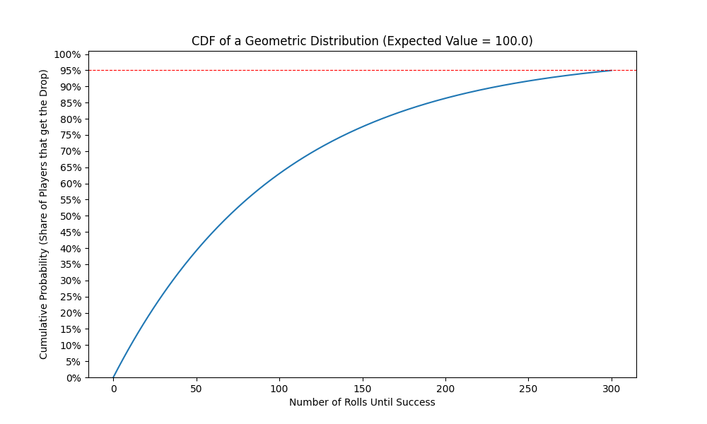
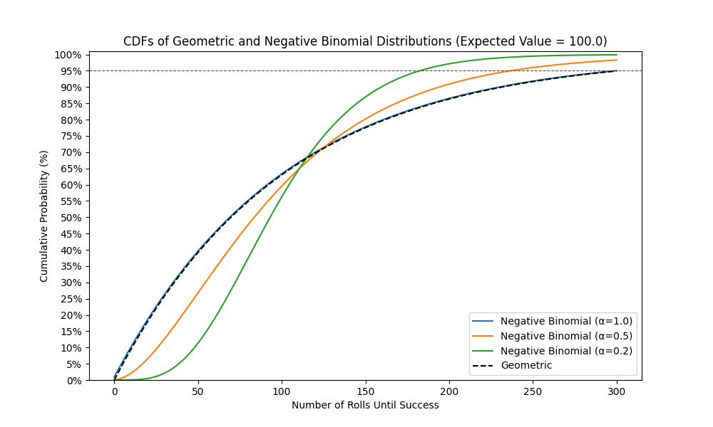

# Designing Fair and Fun Randomness in Video Games via Bad Luck Protection

## Introduction

Random loot drops are a double-edged sword. They add excitement through unpredictability, but they can also lead to frustration when players feel like they're stuck in a cycle of bad luck. This can even drive players away from games they otherwise enjoy. Has anyone else felt like quitting League of Legends after dying to a Tryndamere critting you three times in a row at level 1?

In this article, we'll explore the math behind "bad luck protection", a system that ensures that even the unluckiest players eventually get their desired rewards while maintaining the thrill of chance. This means that we do not use a simple pity mechanic that guarantees a drop after a fixed number of rolls. We instead work out a more complex and interesting approach.

The results may, for example, be applied to item hunting in Oldschool Runescape or World of Warcraft, shiny hunting in Pokémon, the [gacha mechanic](https://en.wikipedia.org/wiki/Gacha_game) in Genshin Impact or even critical hits in League of Legends.

## Mathematical Model

 - a valuable and rare item in [Oldschool Runescape](https://oldschool.runescape.com/)](docs/120px-Dragon_warhammer_detail.webp) 

Each item drop typically has a fixed probability $p$, in this case $1 / 3000$. This means that, on average, you need 3000 rolls to get that specific drop.

These drop rolls are usually independent of each other. You may have already tried 9000 times, having made no progress at all, despite the fact that you should have "earned" the drop a long time ago. And this is not rare: The chance of going over three times the drop rate approaches $e^{-3} \approx 5 \%$ as $p$ goes to zero. So roughly 5 % of players need to roll at least three times as often as they would expect to.

We model our rolls as a so-called stochastic process $(X_n)_{n \in \mathbb{N}}$ with values in $\{0, 1\}$. That is, we have a sequence of random variables that are either 0 (failure) or 1 (success). We are interested in controlling the distribution of
$$T := \min\{n \in \mathbb{N} \mid X_n = 1\}.$$
$T$  essentially tells us how many times a player needs to try before they finally get the item they want.

For example, if it took four rolls to get the item drop, we'd have $X_1, X_2, X_3 = 0$, $X_4 = 1$ and $T = 4$.

### Cumulative Distribution Functions

In the typical case where the rolls $X_n$ are independent of each other, meaning that each roll has the same chance of success, regardless of the previous outcomes, one can show that $T$ follows a geometric distribution.

We're aiming to roughly keep the shape of this cumulative distribution function $F$ while increasing its values on the right so that only few players are very unlucky - fewer than the typical case's 5 %.

As the geometric distribution is fully determined by its expected value, we switch to a two-parameter distribution to be able to control the variance while keeping the expected value fixed. In theory, one may choose almost any such distribution. As a generalization of the geometric distribution, the negative binomial distribution is an obvious candidate.

In the above picture, the negative binomial distribution is parameterized by $\alpha := Var(F) / E[F]^2$. The smaller the $\alpha$, the more aggressive the bad luck protection.

The above approach is very common in statistics: We have two statistics of a distribution we are interested in: Its expected value and 95-percentile. The expected value is assumed to be given, determining the first parameter. And we want to control the 95-percentile, determining the second parameter. While the negative binomial distribution is not defined in terms of these statistics, with some simple calculations, one may re-parameterize it to be.

### From CDFs to Conditional Probabilities

Once we have decided on a cumulative distribution function, we must ask ourselves: How do we go from this CDF to the actual probability of success for a given roll? This probability is not constant $p$ any more!

This "probability that the $n$th roll is successful given that all previous rolls were unsuccessful" is described mathematically by
$$P(X_n = 1 | X_k = 0 \ \forall k < n).$$

This may be written in a nicer form using our definition of $T$, the number of trials needed:
$$P(T = n | T > n-1)$$

This conditional probability is directly related to the cumulative distribution function $F$.
By [Bayes' Theorem](https://en.wikipedia.org/wiki/Bayes%27_theorem) we have
$$P(T = n | T > n-1) = \frac{P(T > n-1 | T = n) \cdot P(T=n)}{P(T > n-1)}.$$

The first probability in the numerator is exactly 1: Given that the number of trials $T$ needed for success is $n$, it is surely greater than $n-1$.

The other terms may be rewritten using $F$:
$$\frac{P(T=n)}{P(T>n-1)} = \frac{F(n)-F(n-1)}{1-F(n-1)}$$

So now we have a nice formula for the chance of success that may easily be implemented by game developers. For the negative binomial distribution, it looks like this:

By adjusting the parameter $\alpha$, game designers can control the degree of bad luck protection. A value of $\alpha = 1$ results in a constant probability - just what we expected from the independent case. Decreasing $\alpha$ reduces the chance early but increases it later on.

## Conclusion

We derived a model in which game developers may choose the strength of bad luck protection using some cumulative distribution function $F$ without resorting to a naive pity mechanic. We gave a simple formula for the probability of success:
$$P(X_n = 1 | X_k = 0 \ \forall k < n) = \frac{F(n)-F(n-1)}{1-F(n-1)}$$

See my [GitHub](https://github.com/NiklasvonM/Bad-Luck-Protection) for the code used in this article.

Do you know any games that implement such a method? Do you feel like you'd prefer a game that uses this method? Do you have other ideas on how to improve fairness of RNG? I'd love to hear your thoughts!
